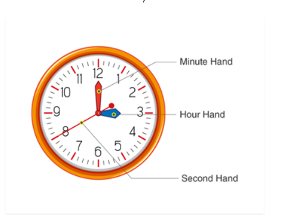
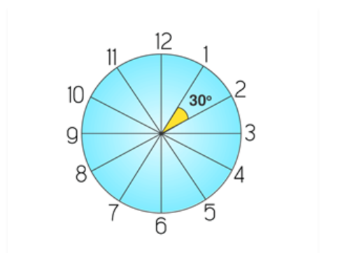
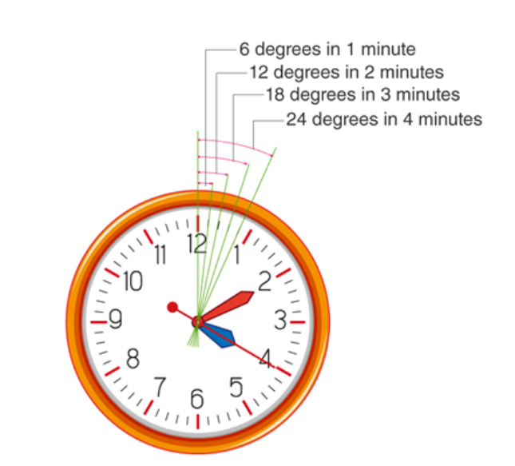

# The angle between any two consecutive divisions = (360°)/12= 30°

# Angular value of a minute = (30°)/5= 6°

# time in mirror

- Ques - 3:15 in mirror what is correct time
- Ans == (11:60 - time given ) i.e 11:60 - 3:15 = 8:45

# Angle between two hands of clock

- Question : what is the angle btw two hand of clock at 8:30

- answer -> hour difference  = 8 - 6(30 sy) = 2  then 2 +/- (minutes/2) 
- take + if hour hand is forward of minutes hand

- formula  = 30H - 11/2 * M

# clock coinside

- Question at what time btw 6 and 7 hands of clock coincide
- trick fraction ka sum ky last my agar 0 aa raha hai vahi ans hai

- Option A -> 6: 32 (8/11) ==> 32+8 = 40 and so last my zero i.e ans hai
- Option B -> 6:34 (8/11)
- Option C -> 6:30 (8/11)
- Option D -> 6:32 (5/7)

- formula --> 6: (12/11 )xM  --> M = 30 because of 6