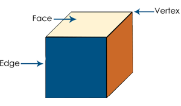
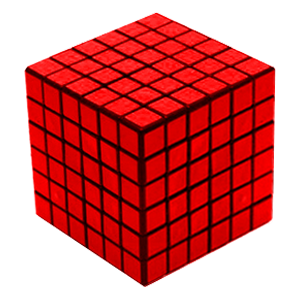
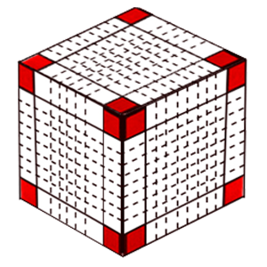

# Theory

- face = 6
- edges = 12
- vertex = 8

- Questions -  a cube with side measuring unit 'x' is painted on all faces and is cut into smaller cubes with sides measuring unit 'y'

- Q1 . total number of cubes 
- ans =>  X*X*X(volume of bigger cube) = N * Y*Y*Y(volume of smaller cube)

- Q2 . number of cubes 3 faces painted 
- ans - the cubes which are on the corner(vertex) will be three face painter == 8

- Q3 . number of cubes 2 face painted 
- ans - 2 face painted cubes will be on edges except the corner or vertex then 
- if we calculate 2 face painted on 1 edge = total number of cubes on 1 edge - 2 (corner cubes with three face painted)
- since we have 12 edges so total number of cubes 2 face painted  = 12 * (number of cubes 2 face painted on 1 edge)

- Q4 number of cubes one face painted
- ans => 1 faces painted cubes will be found on face
- number of cubes 1 face painted on 1 face = total cubes on 1 face - 4* (egde touching cubes on 1 face)

- Q5 . Number of cubes No face painted 
- ans => total number of cubes - 1 face painted - 2 face - 3 face

# Example

# Cube Division Problem

## Example 1
- **Problem:** A cube having a side of 6 cm is painted red on all the faces and then cut into smaller cubes of 1 cm each. Find the total number of smaller cubes so obtained.
- **Solution:** 
  - Number of smaller cubes = (6/1)^3 = 216 smaller cubes.

## Example 2
- **Problem:** In the above example, how many cubes will have three faces painted?
- **Solution:** 
  - Only the corner cubes, i.e., the 8 cubes at the corners of the original cube will have three faces painted. Hence, the answer will be 8.

## Example 3
- **Problem:** In the above example, how many cubes will have only two faces painted?
- **Solution:** 
  - Only the cubes at the edge of the bigger cube can have two faces painted. There are 4 such cubes on each edge, and since there are 12 edges, there will be 4 * 12 = 48 cubes.

## Example 4
- **Problem:** In the above example, how many cubes will have only one face and no side painted?
- **Solution:** 
  - Only the cubes at the face of the bigger cube can have only one painted face. There will be 16 such cubes on each face of the original cube, totaling 16 * 6 = 96 cubes.

## Additional Calculation
- The number of cubes having no faces painted can be found by subtracting the sum of the painted cubes from the total number of smaller cubes. Therefore, the required answer is 216 - (8 + 48 + 96) = 64 cubes.
